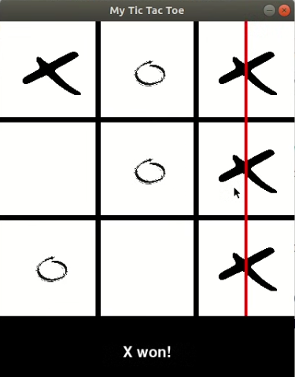

# Tic Tac Toe GUI using Pygame 🎮

This project demonstrates how to build a classic Tic Tac Toe game using Python and the Pygame library. It focuses on GUI design, mouse interaction, game logic, and rendering graphics in real time.

---

## 🚀 Features
- Interactive GUI using Pygame
- Mouse click based input
- Automatic win and draw detection
- Restart game after completion
- Clean and beginner-friendly structure

---

## 🛠️ Technologies Used
- Python 3.x
- Pygame library

---

## 🧠 Project Breakdown
1. Importing Libraries & Global Variables
The game uses pygame, sys, and time. Global variables track player turns, board state, and game results.

2. Game Window Setup
A 400x500 window is created where:
- Top 400px → Game board.
- Bottom 100px → Status messages.

3. Drawing the Game Board
Vertical and horizontal lines divide the board into 9 equal cells.

4. Handling User Input
Mouse clicks are captured and mapped to board positions where X or O is placed.

5. Win & Draw Logic
The game checks:
- Horizontal matches.
- Vertical matches.
- Diagonal matches.
- Draw condition when all cells are filled.

6. Game Reset
After a win or draw, the game automatically resets after 3 seconds.

---

## 📸 Screenshot
 

 ---

## 📌 Learning Outcomes
- Understanding Pygame event handling.
- GUI rendering with Python.
- Implementing basic game logic.
- Managing game state effectively.
